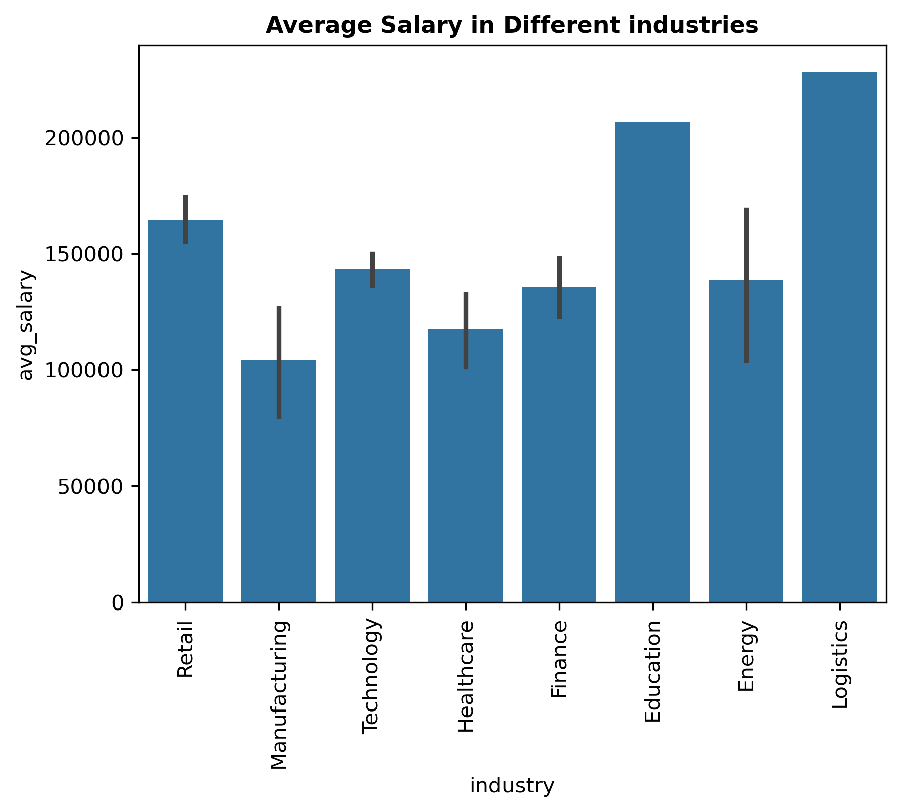
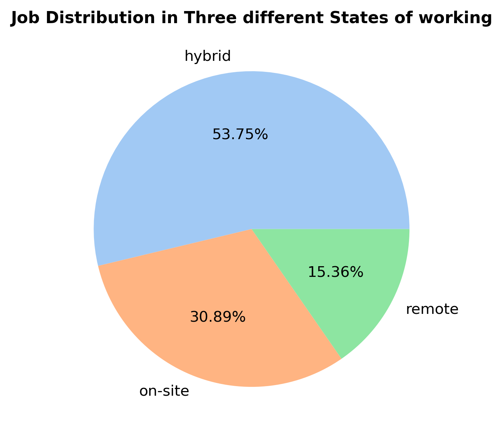
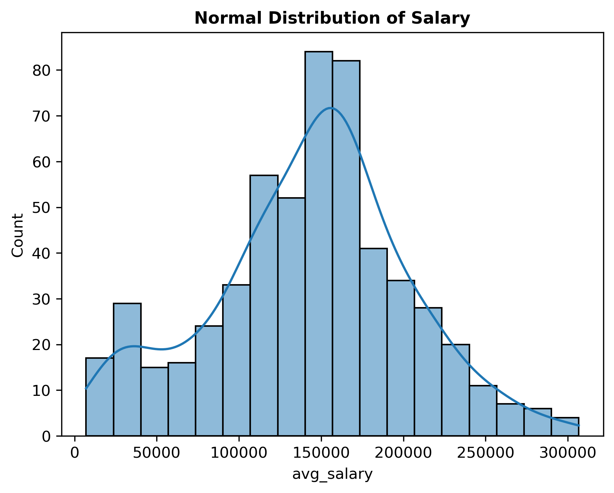
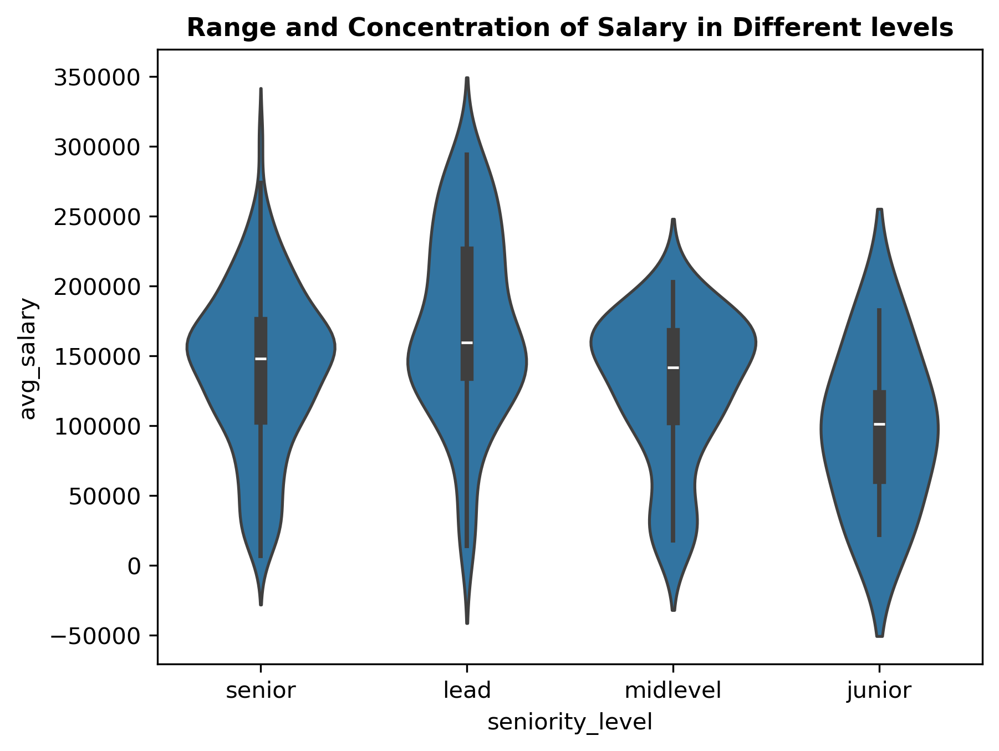

# Project01_Analysing_DataScience_Jobs

## Resource:
This data is sourced from [**www.kaggle.com**](https://www.kaggle.com/datasets/nalisha/data-science-careers-and-salaries-2025)

## Catagorical info about data:

- job_title       : Required ✅
- seniority_level : Required ✅
- status          : Required ✅
- company         : Not Required ❌
- location        : Required ✅
- post_date       ; Not Required ❌
- headquarter     : Not Required ❌
- industry        : Required ✅
- ownership       : Required ✅
- company_size    : Not Required ❌
- revenue         : Not Required ❌
- salary          : Required ✅
- skills.         : Required ✅

|   job_title     | seniority_level | status | location |   industry   | ownership | salary | skills |
|-----------------|-----------------|--------|----------|--------------|-----------|--------|--------|
| data Scientist  | senior          | hybrid |          | Retail       | Public    |        |        |
| machine-learning| lead            | on-site|          | Manufacturing| Private   |        |        |
|    -engineer    | midlevel        | remote |          | Technology   |           |        |        |
| data engineer   | junior          |        |          | Healthcare   |           |        |        |
|                 |                 |        |          | Finance      |           |        |        |
|                 |                 |        |          | Education    |           |        |        |
|                 |                 |        |          | Energy       |           |        |        |
|                 |                 |        |          | Logistics    |           |        |        |

### List of Skills and number of companies who require these skills are: 
- **python**            : 239
- **machine learning**  : 223
- **sql**               : 161
- **r**                 : 119
- **aws**               : 108
- **deep learning**     : 90
- tensorflow        : 83
- pytorch           : 79
- spark             : 77
- azure             : 75
- scikit-learn      : 55
- gcp               : 50
- tableau           : 44
- pandas            : 41
- database          : 38
- scala             : 36
- hadoop            : 36
- java              : 33
- numpy             : 33
- git               : 26
- amazon            : 25
- docker            : 24
- kubernetes        : 23
- matplotlib        : 20
- keras             : 18
- airflow           : 15
- powerbi           : 14
- linux             : 11
- neural network    : 8
- scipy             : 7
- opencv            : 4
- bash              : 2
- sklearn           : 2

## After Cleaning and Processing Data:
### The list of Columns present at this point is as below:

['job_title', 'seniority_level', 'status', 'location', 'industry', 'ownership', 'salary', 'skills', 'min_salary', 'max_salary', 'avg_salary', 'spark', 'r', 'python', 'scala', 'machine learning', 'tensorflow', 'sql', 'aws', 'git', 'docker', 'gcp', 'kubernetes', 'deep learning', 'scikit-learn', 'pytorch', 'keras', 'java', 'pandas', 'powerbi', 'tableau', 'hadoop', 'azure', 'airflow', 'numpy', 'neural network', 'matplotlib', 'database', 'amazon', 'scipy', 'linux', 'bash', 'opencv', 'sklearn', 'Public', 'Private', 'hybrid', 'on-site', 'remote', 'Retail', 'Manufacturing', 'Technology', 'Finance', 'Education', 'Healthcare', 'Energy', 'Logistics', 'senior', 'lead', 'junior', 'midlevel']

## [Done some EDA:](./EDA-interactive_notebook.ipynb)
### Get some idea about the dataset in the following graphs:

  
  

  
  

## Build a model
### I used **Random Forest Regressor** for my Model. And Optimize the Model with GridSearchCV.
### And I productionize it with Flask API.
[Please refer to the directory, by clicking here.](/FlaskAPI/)